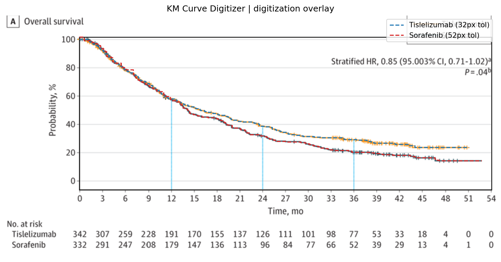
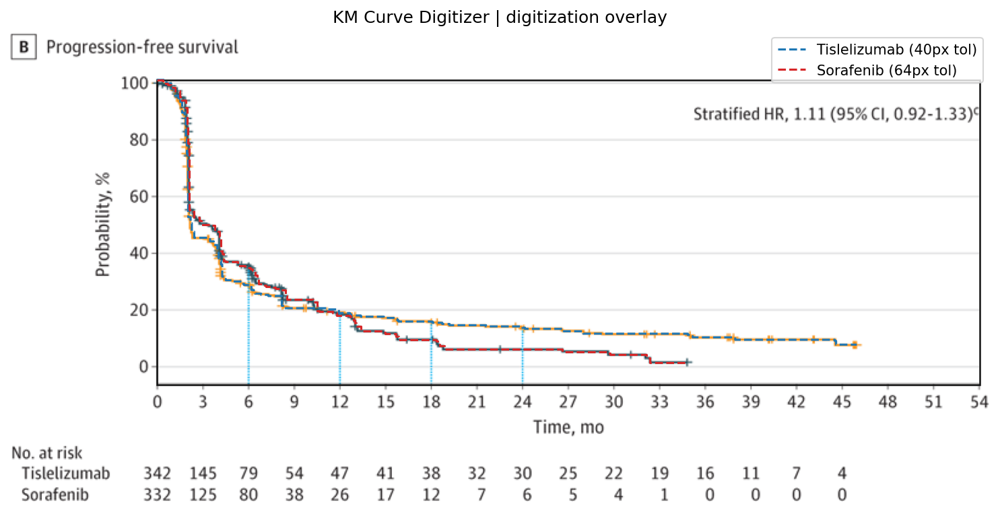
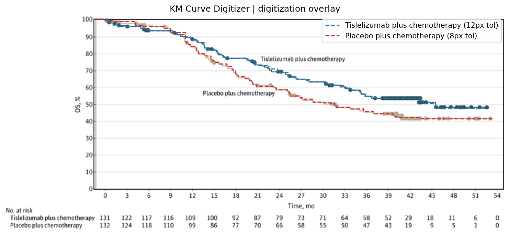
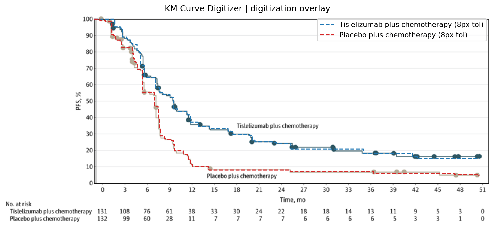
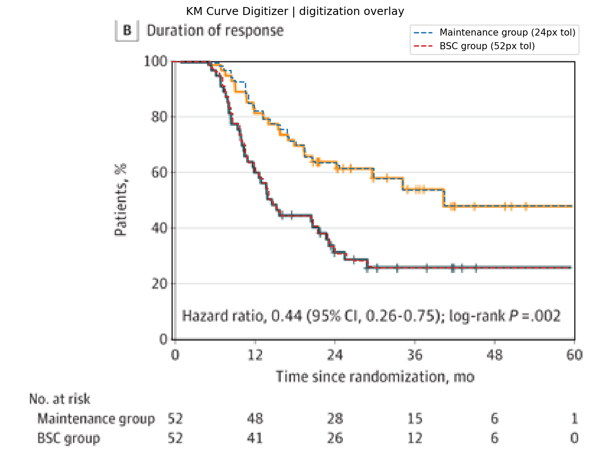
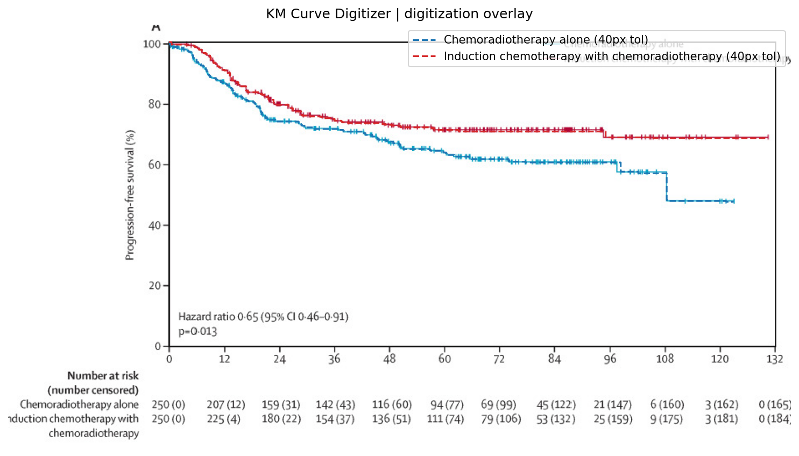

# KM Curve Digitizer Skill

This repository contains the installable Codex skill in [`km-curve-digitizer/`](km-curve-digitizer/).

The skill lets the calling model inspect Kaplan-Meier figures, operate focused editing tools, and verify structured curve and number-at-risk outputs. Deterministic code handles measurement and auditable mutations; the model retains review and editing authority. It intentionally does not reconstruct individual patient data or fit survival models.

## Reviewed examples

These ten overlays are the current accepted OS and PFS results for the five bundled development figures. The dashed traces are the digitized step curves; each underlying figure and number-at-risk table remains visible for direct visual verification.

| Study | OS | PFS |
| --- | --- | --- |
| 01 | [](docs/assets/examples/study01-os.png) | [](docs/assets/examples/study01-pfs.png) |
| 02 | [](docs/assets/examples/study02-os.png) | [](docs/assets/examples/study02-pfs.png) |
| 03 | [](docs/assets/examples/study03-os.png) | [](docs/assets/examples/study03-pfs.png) |
| 04 | [](docs/assets/examples/study04-os.png) | [](docs/assets/examples/study04-pfs.png) |
| 05 | [](docs/assets/examples/study05-os.png) | [](docs/assets/examples/study05-pfs.png) |

The corresponding structured outputs and signature-bound review decisions are indexed in [`runs/summary.json`](runs/summary.json).

## Number-at-risk tables

The skill extracts the printed number-at-risk table independently from the survival curves. Each cell retains a stable ID, curve and time-column identity, confidence, and—when localization is reliable—its source-image pixel bounds. Results are available as long-format CSV and structured JSON for direct use in downstream reconstruction workflows.

For example, the reviewed `study01` PFS table begins:

| Curve | 0 mo | 3 mo | 6 mo | 9 mo | 12 mo |
| --- | ---: | ---: | ---: | ---: | ---: |
| Tislelizumab | 342 | 145 | 79 | 54 | 47 |
| Sorafenib | 332 | 125 | 80 | 38 | 26 |

Codex can inspect the full table or enlarge one ambiguous cell, then set or clear that cell without shifting neighboring columns. It can also correct a shared time column. Every change preserves the parent result and records the previous value in revision history; counts are never inferred from curve height or silently interpolated.

- [Example risk-table CSV](runs/study01/pfs/risk_table.csv)
- [Risk-table inspection and correction workflow](km-curve-digitizer/references/risk-table.md)

## Skill layout

```text
km-curve-digitizer/
├── SKILL.md
├── agents/openai.yaml
├── references/
│   ├── agent-loop.md
│   ├── correction-schema.md
│   ├── risk-table.md
│   └── semantic-schema.md
└── scripts/
    ├── extract_km.py
    ├── refine_km.py
    ├── build_manifest.py
    ├── requirements.txt
    └── km_digitizer/          # internal implementation, not a public package
```

The repository-level `tests/`, `images/`, and `runs/` directories are development fixtures and historical review outputs. They are not required when installing the skill folder. The installed skill can extract both curve coordinates and long-format number-at-risk tables, with auditable edits for either output. Codex supplies semantic JSON from its own image inspection; the skill does not call an external model.

## Development checks

```bash
python3 -m unittest discover -s tests -t . -v
python3 /path/to/skill-creator/scripts/quick_validate.py km-curve-digitizer
```

See [`km-curve-digitizer/SKILL.md`](km-curve-digitizer/SKILL.md) for the agent-facing workflow.
