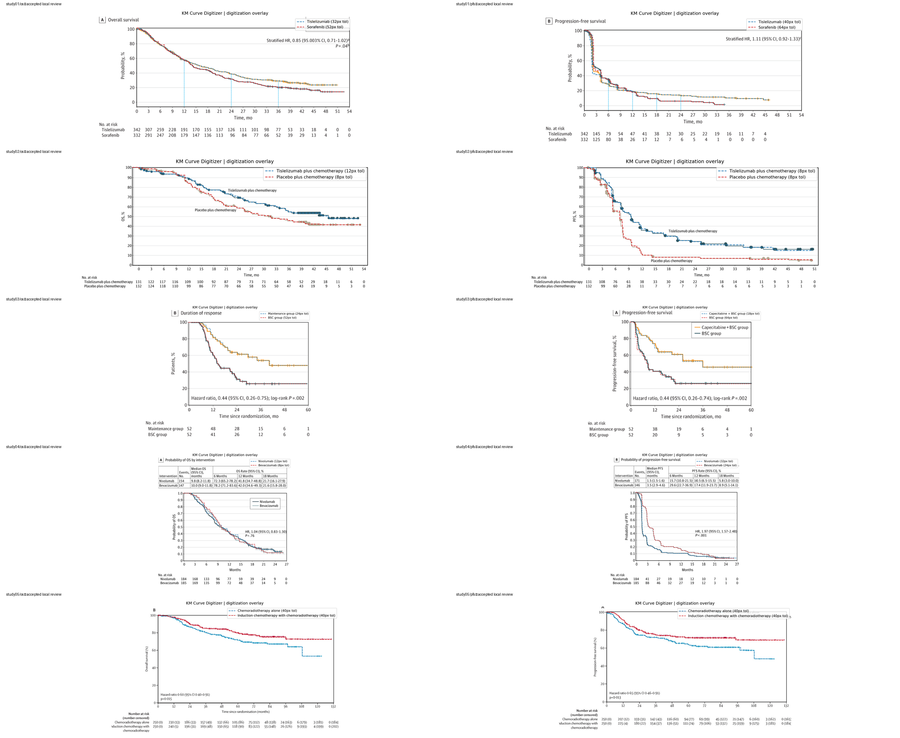

# PyKMExtract

[English](README.md) | **中文** | [Français](README_fr.md)

PyKMExtract 是一个面向研究场景的 Kaplan-Meier 曲线数字化工具。它从论文图中提取结构化 `time / survival` 曲线，完成基础验证，并输出便于复核的表格与可视化叠加图。

## 项目简介

这个项目的核心原则是：

`简单的默认提取链 + 可选的 AI 增强模块`

默认流程尽量保持可解释、可复核。AI 可以参与，但只作为显式增强层，而不是整个测量过程的唯一来源。

当前默认流程：

`semantic -> axis detection -> color extraction -> KM step sampling -> coordinate mapping -> validation`

## 当前状态

当前仓库是一个实用型 MVP，还不是“所有 KM 图都能稳提”的通用数字化器。

已经比较稳定的部分：

- 从 `semantic.json` 或视觉模型读取结构化语义信息
- 在常见白底 KM 图上自动检测左轴和底轴
- 对 1-2 条高对比彩色曲线做颜色提取
- 使用 KM 风格的阶梯采样，而不是简单线性插值
- 输出验证分数、问题清单和人工 review bundle
- 导出通用 CSV，便于接入任意生存分析工具

当前仍然保守的部分：

- 灰度图或颜色接近的曲线
- 多条线密集重叠的图
- 明显置信区间带和密集删失标记
- 低分辨率扫描图或压缩截图
- 全自动 PDF 拆页和 GUI 级别手工修正

## 主要能力

- 结构化语义提取：支持 `semantic.json` 或 OpenAI 兼容视觉接口
- 坐标轴边界检测与可选四点校轴
- KM 专用阶梯采样
- 验证信号：单调性、范围、coverage、`at-risk`、重合歧义
- 人工核查 bundle：`overlay.png`、`review.md`、数字化曲线 CSV 和验证问题 CSV
- 支持 `study01_full.png / study01_pfs.png / study01_os.png` 这类 grouped study 批处理

## 安装

开发期推荐：

```bash
pip install -e .
```

或者直接从源码运行：

```bash
PYTHONPATH=src python3 -m pykmextract.cli ...
```

## 快速开始

### 1. 单图 + 已准备好的 semantic JSON

```bash
PYTHONPATH=src python3 -m pykmextract.cli figure.png \
  --semantic-json semantic.json \
  --output-json extraction.json \
  --overlay overlay.png
```

### 2. 单图 + OpenAI 兼容视觉接口

```bash
export OPENROUTER_API_KEY="..."
PYTHONPATH=src python3 -m pykmextract.cli figure.png \
  --provider openai-compatible \
  --base-url https://openrouter.ai/api/v1 \
  --model openai/gpt-5.4 \
  --api-key-env OPENROUTER_API_KEY \
  --output-json extraction.json \
  --overlay overlay.png
```

### 3. 开启可选 AI 校轴

```bash
export OPENROUTER_API_KEY="..."
PYTHONPATH=src python3 -m pykmextract.cli figure.png \
  --provider openai-compatible \
  --base-url https://openrouter.ai/api/v1 \
  --model openai/gpt-5.4 \
  --api-key-env OPENROUTER_API_KEY \
  --axis-refine \
  --axis-review-image axis_review.png \
  --output-json extraction.json \
  --overlay overlay.png
```

### 4. Python 调用

```python
import pykmextract as pkm

result = pkm.extract("figure.png", semantic=semantic_payload)
curve_df = result.curve_frame()
validation_df = result.validation_frame()

result.save_review_bundle("runs/example")
```

## 批处理流程

推荐文件命名：

- `study01_full.png`
- `study01_pfs.png`
- `study01_os.png`

生成 manifest：

```bash
PYTHONPATH=src python3 -m pykmextract.batch \
  --image-dir images \
  --literature-md images/literatures.md \
  --output-json images/manifest.json
```

执行 grouped extraction：

```bash
export OPENROUTER_API_KEY="..."
PYTHONPATH=src python3 -m pykmextract.batch_run \
  --image-dir images \
  --literature-md images/literatures.md \
  --base-url https://openrouter.ai/api/v1 \
  --model openai/gpt-5.4 \
  --api-key-env OPENROUTER_API_KEY \
  --axis-refine \
  --output-dir runs/openrouter-batch
```

批处理输出按 study 和 endpoint 组织：

- `runs/study01/os/`
- `runs/study01/pfs/`
- `runs/study02/os/`
- `runs/study02/pfs/`

## 输出内容

主要结构化字段：

- `semantic`
- `axis_bounds`
- `axis_anchors`
- `curves[].time`
- `curves[].survival`
- `validation.score`
- `validation.level`
- `validation.issues`

review bundle 主要包含：

- `original.png`
- `overlay.png`
- `digitized_curves.csv`
- `review.md`
- `validation_issues.csv`

## 当前真实图结果

最新 batch 汇总：

- [`runs/summary.json`](runs/summary.json)

当前 10 张 panel overlay 总览：



下面这张表不是简单照抄 score，而是结合我逐张看 overlay 后写的人工观感评价。

| Panel | Score / Level | 观感评价 | 主要问题 |
| --- | --- | --- | --- |
| `study01 / os` | `80 / high` | 较好 | 尾部与 `at-risk` 有偏差 |
| `study01 / pfs` | `85 / high` | 可用但中后段偏弱 | `Sorafenib` 后半段 coverage 不足 |
| `study02 / os` | `80 / high` | 可用 | 两条线都与 `at-risk` 有偏离 |
| `study02 / pfs` | `80 / high` | 偏弱 | `Placebo plus chemotherapy` 中后段仍然偏低 |
| `study03 / os` | `80 / high` | 偏弱 | 台阶较粗，`at-risk` 一致性弱 |
| `study03 / pfs` | `80 / high` | 偏弱 | 后段仍像近似曲线 |
| `study04 / os` | `100 / high` | 当前最好 | 与原图最接近 |
| `study04 / pfs` | `100 / medium` | 较好但仍需人工复核 | 两条线长段重合 |
| `study05 / os` | `80 / high` | 较好 | 视觉效果好，主要扣分来自 `at-risk` |
| `study05 / pfs` | `80 / high` | 较好 | 与 `study05 / os` 类似 |

更客观的结论是：

- `study04 / os` 是当前最适合作为展示图的一张
- `study05 / os` 和 `study05 / pfs` 的视觉效果比表面上的 `80 / high` 更好
- `study02 / pfs`、`study03 / os`、`study03 / pfs` 仍然属于偏弱样本
- `study04 / pfs` 被主动压到 `medium`，是因为 `overlap_ambiguity`，不是算分错误

## 仓库结构

关键模块：

- [`src/pykmextract/pipeline.py`](src/pykmextract/pipeline.py)：主提取编排
- [`src/pykmextract/runtime.py`](src/pykmextract/runtime.py)：CLI 和 batch 共用运行层
- [`src/pykmextract/extractor/semantic.py`](src/pykmextract/extractor/semantic.py)：语义解析与归一化
- [`src/pykmextract/extractor/coord.py`](src/pykmextract/extractor/coord.py)：坐标轴检测与像素到数据映射
- [`src/pykmextract/extractor/pixel.py`](src/pykmextract/extractor/pixel.py)：颜色提取与 KM 阶梯采样
- [`src/pykmextract/extractor/validator.py`](src/pykmextract/extractor/validator.py)：验证与置信度评分
- [`src/pykmextract/extractor/axis_refiner.py`](src/pykmextract/extractor/axis_refiner.py)：AI 校轴主编排
- [`src/pykmextract/extractor/_axis_refiner_prompts.py`](src/pykmextract/extractor/_axis_refiner_prompts.py)：校轴 prompt
- [`src/pykmextract/extractor/_axis_refiner_payloads.py`](src/pykmextract/extractor/_axis_refiner_payloads.py)：候选点和 payload 处理
- [`src/pykmextract/extractor/_axis_refiner_board.py`](src/pykmextract/extractor/_axis_refiner_board.py)：校轴 review board
- [`src/pykmextract/enhancements.py`](src/pykmextract/enhancements.py)：可选 AI 增强模块
- [`src/pykmextract/microtune.py`](src/pykmextract/microtune.py)：受限后处理微调工具
- [`src/pykmextract/review.py`](src/pykmextract/review.py)：overlay 与 review bundle 导出

## 开发

运行完整测试：

```bash
python3 -m unittest discover -s tests -v
```

当前测试覆盖：

- synthetic 端到端提取
- CLI smoke paths
- axis refinement prompt 与候选逻辑
- pixel sampling 行为
- review bundle 导出
- provider 响应解析

项目附加文件：

- [LICENSE](LICENSE)
- [贡献指南](CONTRIBUTING.md)
- [更新日志](CHANGELOG.md)

## 设计原则

- 默认提取链保持简单
- AI 增强显式可选
- 尽量使用可解释启发式，而不是不断堆特判
- 难图应作为失败案例保留下来，而不是强行伪装成高置信成功
