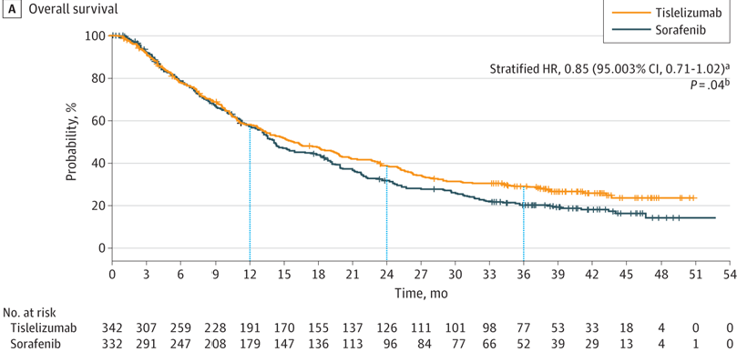
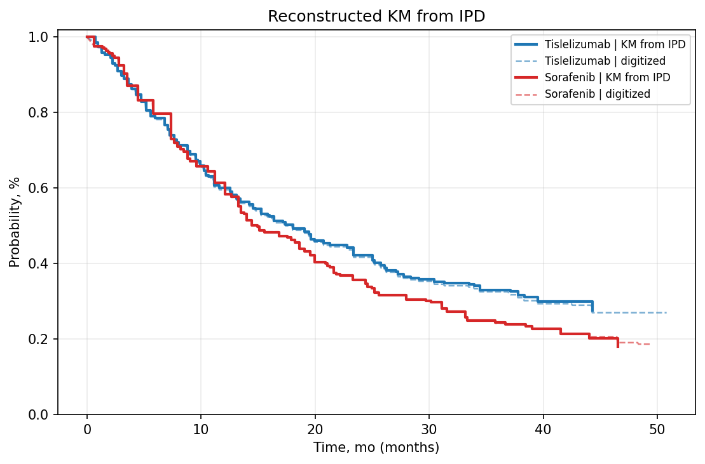
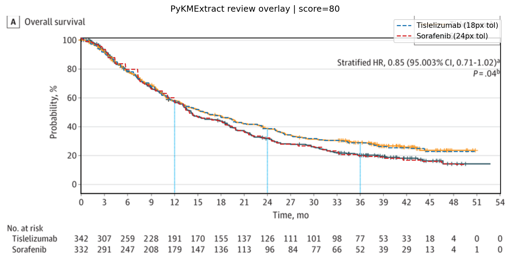
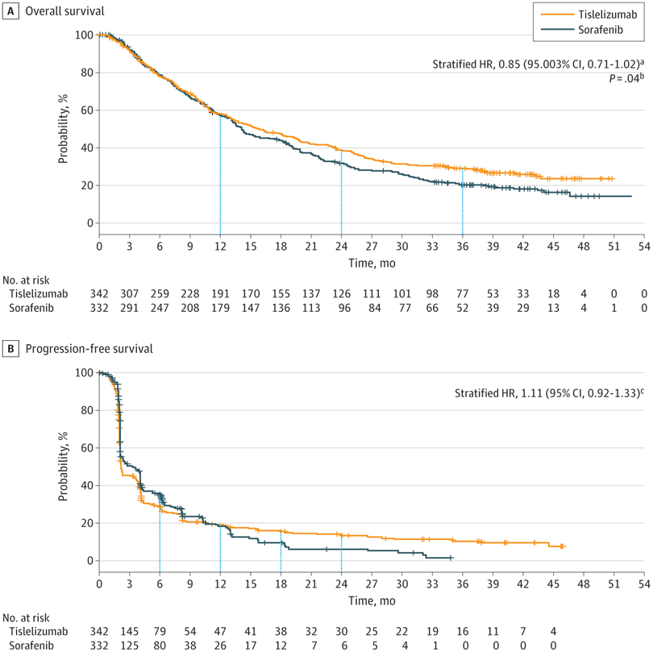

# Review Bundle: study01_os

## Summary

- Validation score: `80`
- Validation level: `high`
- Image: `study01_os.png`
- Notes: Focused on panel A (Overall survival) only. Legend shared within figure indicates orange=Tislelizumab and blue=Sorafenib. No total event counts shown for OS panel. Censoring marks are visible as tick marks on curves.

## Citation

Qin S, Kudo M, Meyer T, et al. Tislelizumab vs Sorafenib as First-Line Treatment for Unresectable Hepatocellular Carcinoma: A Phase 3 Randomized Clinical Trial. JAMA Oncol. 2023;9(12):1651–1659. doi:10.1001/jamaoncol.2023.4003

## Side-by-Side Review

| Original panel | KM redrawn from reconstructed IPD |
| --- | --- |
|  |  |

## Overlay

## Semantic Context Figure

## Curves

- `Tislelizumab`: 632 points, tolerance=18
- `Sorafenib`: 617 points, tolerance=24

## Files

- [digitized_curves.csv](digitized_curves.csv)
- [ipd_tislelizumab.csv](ipd_tislelizumab.csv)
- [ipd_sorafenib.csv](ipd_sorafenib.csv)
