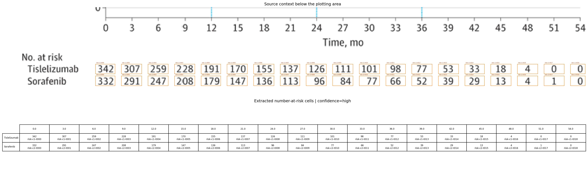

# Review Bundle: study01 OS

## Summary

- Visual acceptance: `pending model review`
- Diagnostic checks: `6/6 passed` (navigation only)
- Diagnostic issues: `0`
- Image: `study01_os.png`
- Notes: Focused on panel A (Overall survival) only. Legend shared within figure indicates orange=Tislelizumab and blue=Sorafenib. No total event counts shown for OS panel. Censoring marks are visible as tick marks on curves.

## Citation

Qin S, Kudo M, Meyer T, et al. Tislelizumab vs Sorafenib as First-Line Treatment for Unresectable Hepatocellular Carcinoma: A Phase 3 Randomized Clinical Trial. JAMA Oncol. 2023;9(12):1651–1659. doi:10.1001/jamaoncol.2023.4003

## Side-by-Side Review

| Original panel | Digitization overlay |
| --- | --- |
|  |  |

## Number at Risk

## Curves

- `Tislelizumab`: 643 points, tolerance=32
- `Sorafenib`: 657 points, tolerance=52

## Validation Issues

- None

## Files

- [digitized_curves.csv](digitized_curves.csv)
- [validation_issues.csv](validation_issues.csv)
- [risk_table.csv](risk_table.csv)
- [risk_table.json](risk_table.json)
