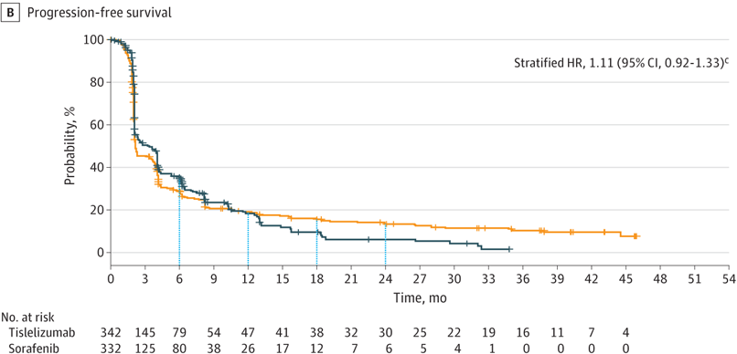
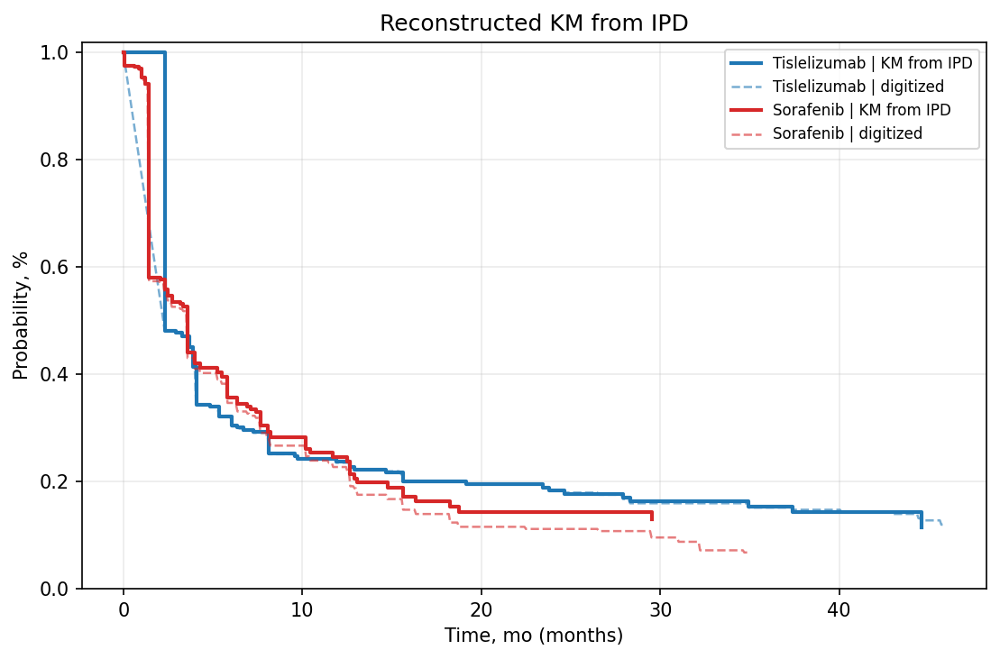
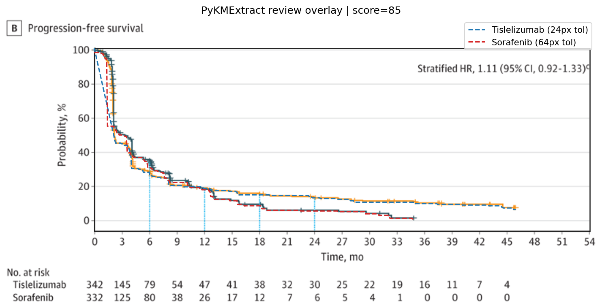

# Review Bundle: study01_pfs

## Summary

- Validation score: `85`
- Validation level: `high`
- Image: `study01_pfs.png`
- Notes: Focused on panel B (Progression-free survival). Legend/color mapping taken from the figure legend shown with panel A. At-risk table for PFS appears at 3-month intervals from 0 to 45 months; no total event counts are shown for the PFS panel.

## Citation

Qin S, Kudo M, Meyer T, et al. Tislelizumab vs Sorafenib as First-Line Treatment for Unresectable Hepatocellular Carcinoma: A Phase 3 Randomized Clinical Trial. JAMA Oncol. 2023;9(12):1651–1659. doi:10.1001/jamaoncol.2023.4003

## Side-by-Side Review

| Original panel | KM redrawn from reconstructed IPD |
| --- | --- |
|  |  |

## Overlay

## Semantic Context Figure

## Curves

- `Tislelizumab`: 549 points, tolerance=24
- `Sorafenib`: 438 points, tolerance=64

## Files

- [digitized_curves.csv](digitized_curves.csv)
- [ipd_tislelizumab.csv](ipd_tislelizumab.csv)
- [ipd_sorafenib.csv](ipd_sorafenib.csv)
