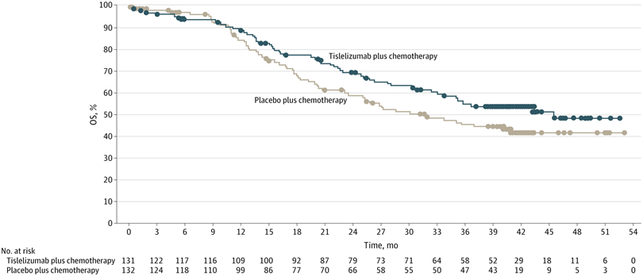
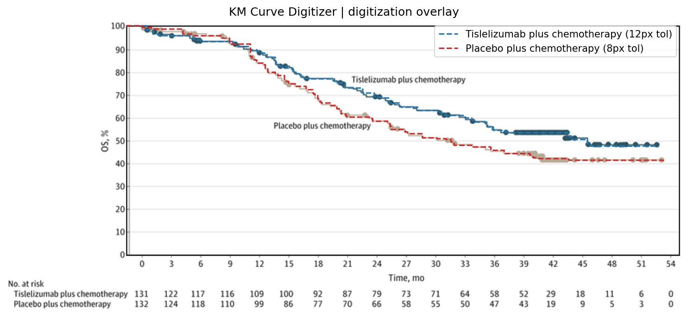
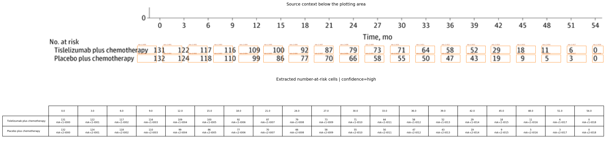

# Review Bundle: study02 os detailed review

## Summary

- Visual acceptance: `accepted after detailed local model review`; see `review_decision.json`
- Diagnostic checks: `6/6 passed` (navigation only)
- Diagnostic issues: `0`
- Image: `study02_os.png`
- Notes: Single OS panel extracted. Group names are labeled directly on the curves. X-axis unit inferred from 'Time, mo'. No total event counts are shown.

## Citation

Not provided

## Side-by-Side Review

| Original panel | Digitization overlay |
| --- | --- |
|  |  |

## Number at Risk

## Curves

- `Tislelizumab plus chemotherapy`: 618 points, tolerance=12
- `Placebo plus chemotherapy`: 628 points, tolerance=8

## Validation Issues

- None

## Files

- [digitized_curves.csv](digitized_curves.csv)
- [validation_issues.csv](validation_issues.csv)
- [risk_table.csv](risk_table.csv)
- [risk_table.json](risk_table.json)
