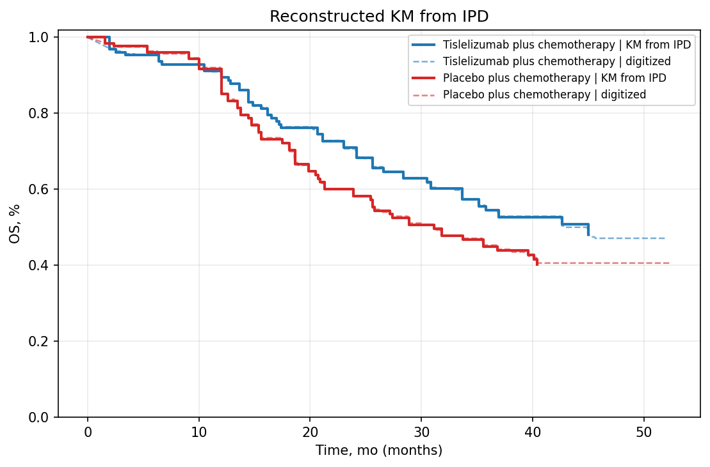

# Review Bundle: study02_os

## Summary

- Validation score: `80`
- Validation level: `high`
- Image: `study02_os.png`
- Notes: Single OS panel extracted. Group names are labeled directly on the curves. X-axis unit inferred from 'Time, mo'. No total event counts are shown.

## Citation

Yang Y, Yen C, Pan J, et al. First-Line Tislelizumab Plus Chemotherapy for Recurrent or Metastatic Nasopharyngeal Cancer: Three-Year Follow-Up of the Phase 3 RATIONALE-309 Randomized Clinical Trial. JAMA Oncol. Published online February 26, 2026. doi:10.1001/jamaoncol.2026.0020

## Side-by-Side Review

| Original panel | KM redrawn from reconstructed IPD |
| --- | --- |
|  |  |

## Overlay

## Curves

- `Tislelizumab plus chemotherapy`: 618 points, tolerance=12
- `Placebo plus chemotherapy`: 628 points, tolerance=8

## Files

- [digitized_curves.csv](digitized_curves.csv)
- [ipd_tislelizumab_plus_chemotherapy.csv](ipd_tislelizumab_plus_chemotherapy.csv)
- [ipd_placebo_plus_chemotherapy.csv](ipd_placebo_plus_chemotherapy.csv)
