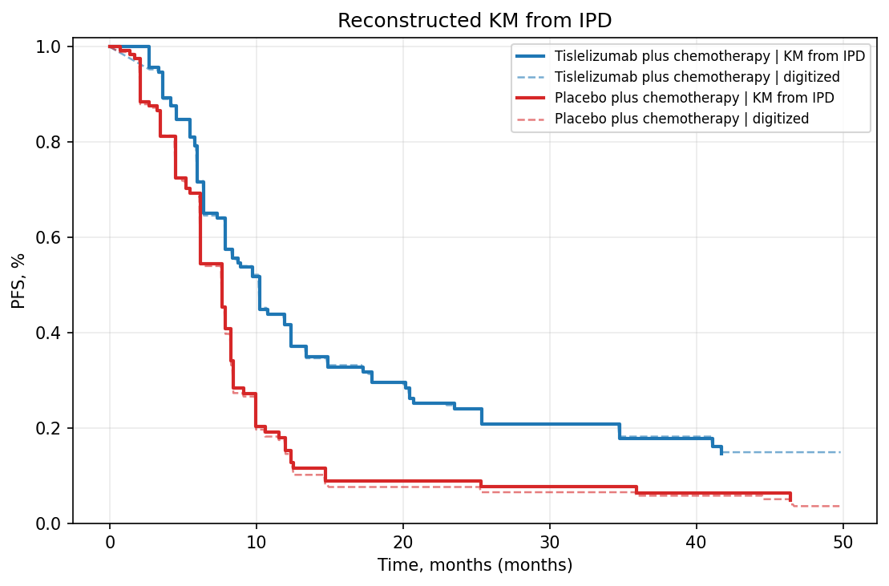

# Review Bundle: study02_pfs

## Summary

- Validation score: `80`
- Validation level: `high`
- Image: `study02_pfs.png`
- Notes: Focused on the PFS panel only. Legend labels were read from in-plot text next to each curve. No confidence interval shading/bands are visible. Circular markers indicate censoring. X-axis label is not explicitly visible in the crop, but months are implied by the tick marks and standard KM formatting.

## Citation

Yang Y, Yen C, Pan J, et al. First-Line Tislelizumab Plus Chemotherapy for Recurrent or Metastatic Nasopharyngeal Cancer: Three-Year Follow-Up of the Phase 3 RATIONALE-309 Randomized Clinical Trial. JAMA Oncol. Published online February 26, 2026. doi:10.1001/jamaoncol.2026.0020

## Side-by-Side Review

| Original panel | KM redrawn from reconstructed IPD |
| --- | --- |
|  |  |

## Overlay

## Curves

- `Tislelizumab plus chemotherapy`: 611 points, tolerance=8
- `Placebo plus chemotherapy`: 636 points, tolerance=32

## Files

- [digitized_curves.csv](digitized_curves.csv)
- [ipd_tislelizumab_plus_chemotherapy.csv](ipd_tislelizumab_plus_chemotherapy.csv)
- [ipd_placebo_plus_chemotherapy.csv](ipd_placebo_plus_chemotherapy.csv)
