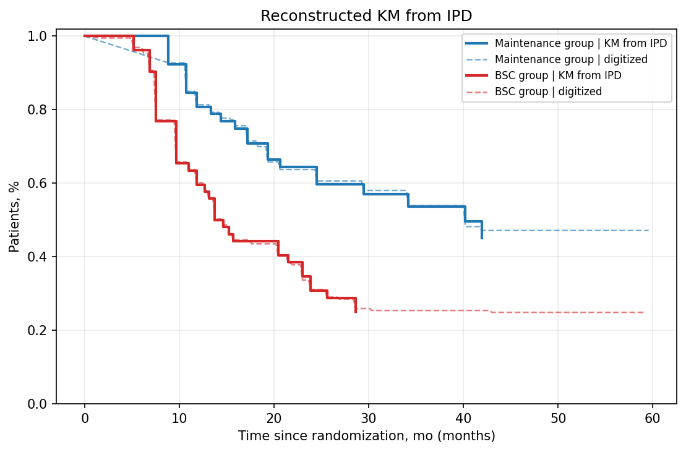

# Review Bundle: study03_os

## Summary

- Validation score: `80`
- Validation level: `high`
- Image: `study03_os.png`
- Notes: Focused on panel B (Duration of response), which is the only panel with y-axis labeled 'Patients, %' and an at-risk table for Maintenance group vs BSC group. Legend names inferred from the at-risk labels because no separate legend is shown in this panel. Hazard ratio text present, but total events are not reported.

## Citation

Liu G, Li W, Wang D, et al. Effect of Capecitabine Maintenance Therapy Plus Best Supportive Care vs Best Supportive Care Alone on Progression-Free Survival Among Patients With Newly Diagnosed Metastatic Nasopharyngeal Carcinoma Who Had Received Induction Chemotherapy: A Phase 3 Randomized Clinical Trial. JAMA Oncol. 2022;8(4):553–561. doi:10.1001/jamaoncol.2021.7366

## Side-by-Side Review

| Original panel | KM redrawn from reconstructed IPD |
| --- | --- |
|  |  |

## Overlay

## Semantic Context Figure

## Curves

- `Maintenance group`: 238 points, tolerance=18
- `BSC group`: 270 points, tolerance=52

## Files

- [digitized_curves.csv](digitized_curves.csv)
- [ipd_maintenance_group.csv](ipd_maintenance_group.csv)
- [ipd_bsc_group.csv](ipd_bsc_group.csv)
