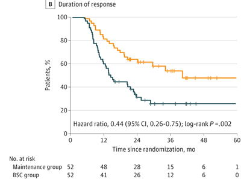
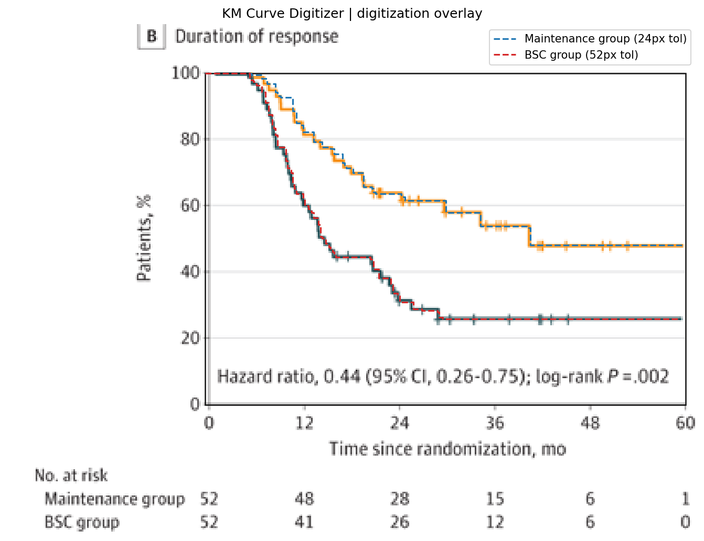
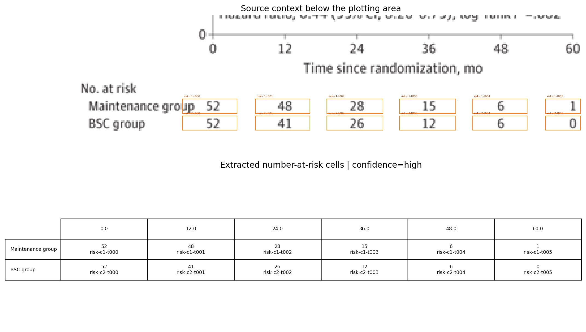

# Review Bundle: study03 os detailed review

## Summary

- Visual acceptance: `accepted after detailed local model review`; see `review_decision.json`
- Diagnostic checks: `6/6 passed` (navigation only)
- Diagnostic issues: `0`
- Image: `study03_os.png`
- Notes: Focused on panel B (Duration of response), which is the only panel with y-axis labeled 'Patients, %' and an at-risk table for Maintenance group vs BSC group. Legend names inferred from the at-risk labels because no separate legend is shown in this panel. Hazard ratio text present, but total events are not reported.

## Citation

Not provided

## Side-by-Side Review

| Original panel | Digitization overlay |
| --- | --- |
|  |  |

## Number at Risk

## Curves

- `Maintenance group`: 252 points, tolerance=24
- `BSC group`: 270 points, tolerance=52

## Validation Issues

- None

## Files

- [digitized_curves.csv](digitized_curves.csv)
- [validation_issues.csv](validation_issues.csv)
- [risk_table.csv](risk_table.csv)
- [risk_table.json](risk_table.json)
