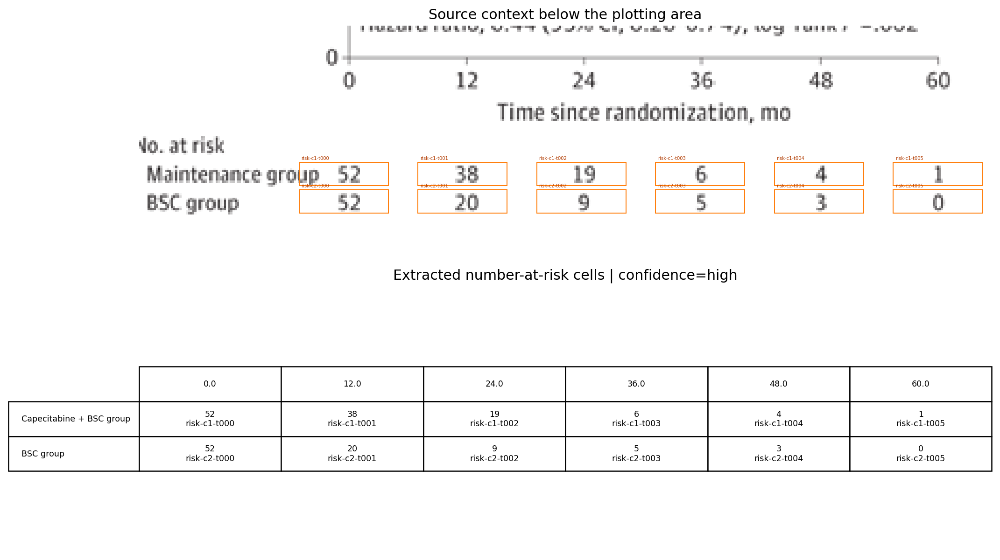

# Review Bundle: study03 pfs detailed review

## Summary

- Visual acceptance: `accepted after detailed local model review`; see `review_decision.json`
- Diagnostic checks: `6/6 passed` (navigation only)
- Diagnostic issues: `0`
- Image: `study03_pfs.png`
- Notes: Focused on panel A (Progression-free survival). Legend labels taken from the PFS panel. Censoring marks are present on both curves. Hazard ratio text is visible but total events by curve are not reported.

## Citation

Not provided

## Side-by-Side Review

| Original panel | Digitization overlay |
| --- | --- |
|  |  |

## Number at Risk

## Curves

- `Capecitabine + BSC group`: 258 points, tolerance=18
- `BSC group`: 278 points, tolerance=64

## Validation Issues

- None

## Files

- [digitized_curves.csv](digitized_curves.csv)
- [validation_issues.csv](validation_issues.csv)
- [risk_table.csv](risk_table.csv)
- [risk_table.json](risk_table.json)
