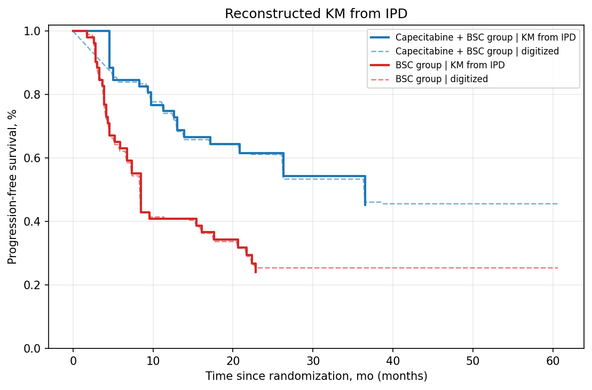
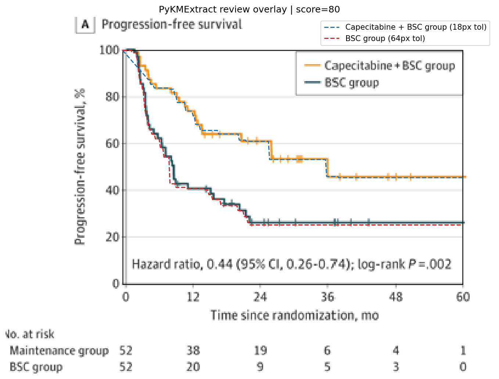
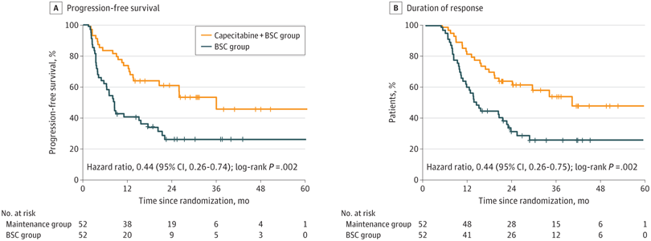

# Review Bundle: study03_pfs

## Summary

- Validation score: `80`
- Validation level: `high`
- Image: `study03_pfs.png`
- Notes: Focused on panel A (Progression-free survival). Legend labels taken from the PFS panel. Censoring marks are present on both curves. Hazard ratio text is visible but total events by curve are not reported.

## Citation

Liu G, Li W, Wang D, et al. Effect of Capecitabine Maintenance Therapy Plus Best Supportive Care vs Best Supportive Care Alone on Progression-Free Survival Among Patients With Newly Diagnosed Metastatic Nasopharyngeal Carcinoma Who Had Received Induction Chemotherapy: A Phase 3 Randomized Clinical Trial. JAMA Oncol. 2022;8(4):553–561. doi:10.1001/jamaoncol.2021.7366

## Side-by-Side Review

| Original panel | KM redrawn from reconstructed IPD |
| --- | --- |
|  |  |

## Overlay

## Semantic Context Figure

## Curves

- `Capecitabine + BSC group`: 261 points, tolerance=18
- `BSC group`: 278 points, tolerance=64

## Files

- [digitized_curves.csv](digitized_curves.csv)
- [ipd_capecitabine_bsc_group.csv](ipd_capecitabine_bsc_group.csv)
- [ipd_bsc_group.csv](ipd_bsc_group.csv)
