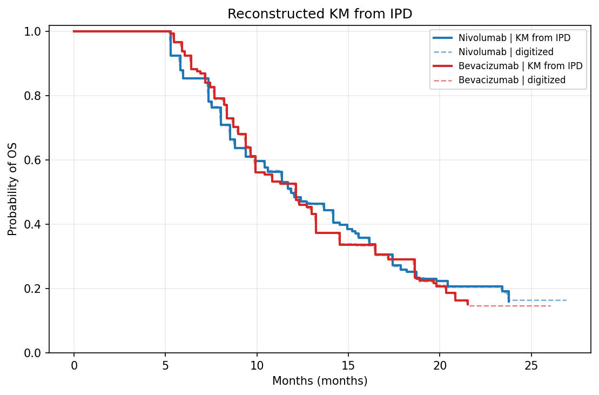

# Review Bundle: study04_os

## Summary

- Validation score: `100`
- Validation level: `high`
- Image: `study04_os.png`
- Notes: Focused on panel A (OS) only. Total events and median OS were taken from the OS summary table above the plot. Legend is inside the OS panel; curve-color mapping estimated visually.

## Citation

Reardon DA, Brandes AA, Omuro A, et al. Effect of Nivolumab vs Bevacizumab in Patients With Recurrent Glioblastoma: The CheckMate 143 Phase 3 Randomized Clinical Trial. JAMA Oncol. 2020;6(7):1003–1010. doi:10.1001/jamaoncol.2020.1024

## Side-by-Side Review

| Original panel | KM redrawn from reconstructed IPD |
| --- | --- |
|  |  |

## Overlay

## Semantic Context Figure

## Curves

- `Nivolumab`: 296 points, tolerance=18
- `Bevacizumab`: 303 points, tolerance=12

## Files

- [digitized_curves.csv](digitized_curves.csv)
- [ipd_nivolumab.csv](ipd_nivolumab.csv)
- [ipd_bevacizumab.csv](ipd_bevacizumab.csv)
