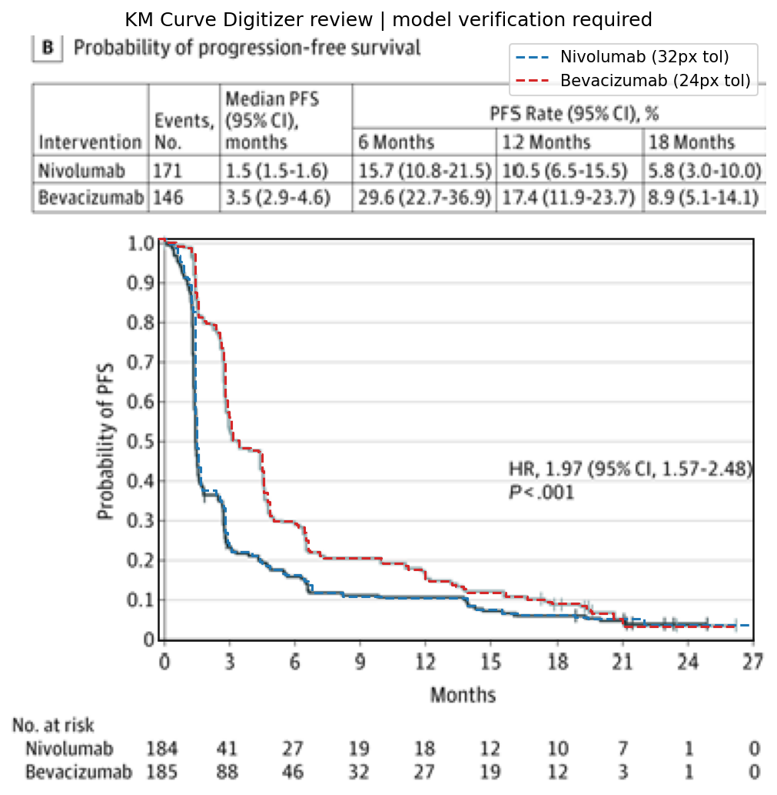

# Review Bundle: study04 PFS

## Summary

- Visual acceptance: `pending model review`
- Diagnostic checks: `6/6 passed` (navigation only)
- Diagnostic issues: `0`
- Image: `study04_pfs.png`
- Notes: Extracted only from panel B (progression-free survival). Curve labels were inferred using the shared legend in panel A and intervention names shown in the panel B summary table. Median PFS table in panel B lists events as 171 for Nivolumab and 146 for Bevacizumab.

## Citation

Reardon DA, Brandes AA, Omuro A, et al. Effect of Nivolumab vs Bevacizumab in Patients With Recurrent Glioblastoma: The CheckMate 143 Phase 3 Randomized Clinical Trial. JAMA Oncol. 2020;6(7):1003–1010. doi:10.1001/jamaoncol.2020.1024

## Side-by-Side Review

| Original panel | Digitization overlay |
| --- | --- |
|  |  |

## Number at Risk

## Curves

- `Nivolumab`: 307 points, tolerance=32
- `Bevacizumab`: 299 points, tolerance=24

## Validation Issues

- None

## Files

- [digitized_curves.csv](digitized_curves.csv)
- [validation_issues.csv](validation_issues.csv)
- [risk_table.csv](risk_table.csv)
- [risk_table.json](risk_table.json)
