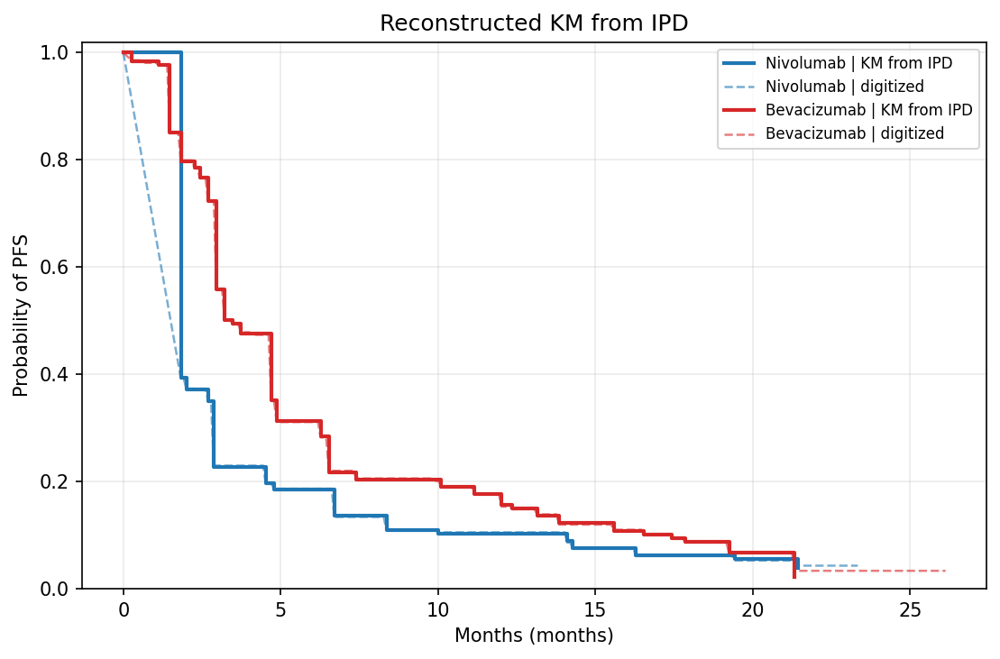
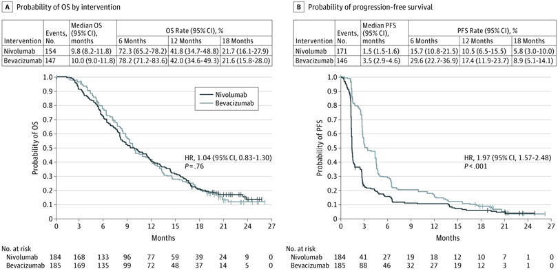

# Review Bundle: study04_pfs

## Summary

- Validation score: `100`
- Validation level: `medium`
- Image: `study04_pfs.png`
- Notes: Extracted only from panel B (progression-free survival). Curve labels were inferred using the shared legend in panel A and intervention names shown in the panel B summary table. Median PFS table in panel B lists events as 171 for Nivolumab and 146 for Bevacizumab.

## Citation

Reardon DA, Brandes AA, Omuro A, et al. Effect of Nivolumab vs Bevacizumab in Patients With Recurrent Glioblastoma: The CheckMate 143 Phase 3 Randomized Clinical Trial. JAMA Oncol. 2020;6(7):1003–1010. doi:10.1001/jamaoncol.2020.1024

## Side-by-Side Review

| Original panel | KM redrawn from reconstructed IPD |
| --- | --- |
|  |  |

## Overlay

## Semantic Context Figure

## Curves

- `Nivolumab`: 249 points, tolerance=12
- `Bevacizumab`: 299 points, tolerance=12

## Files

- [digitized_curves.csv](digitized_curves.csv)
- [ipd_nivolumab.csv](ipd_nivolumab.csv)
- [ipd_bevacizumab.csv](ipd_bevacizumab.csv)
