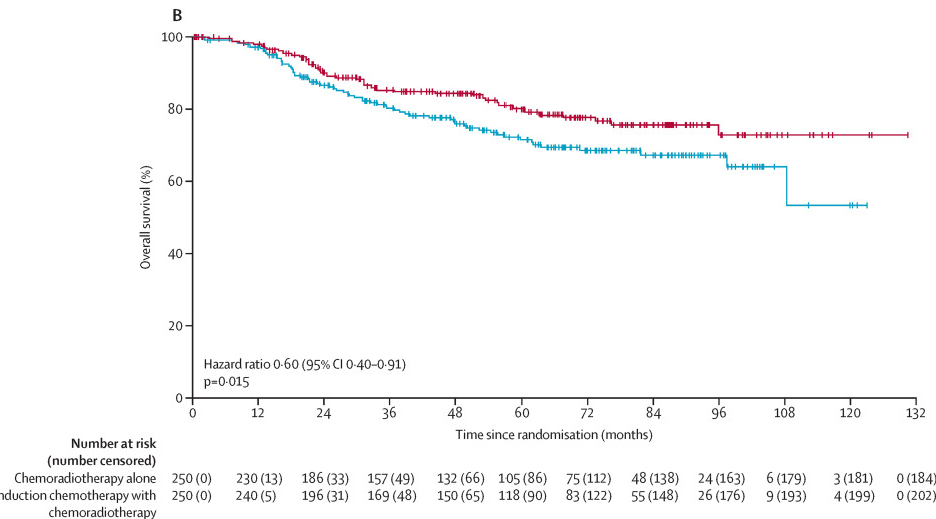
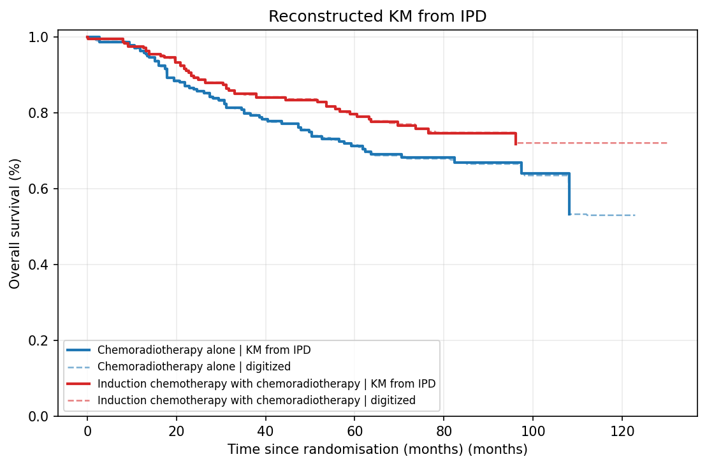
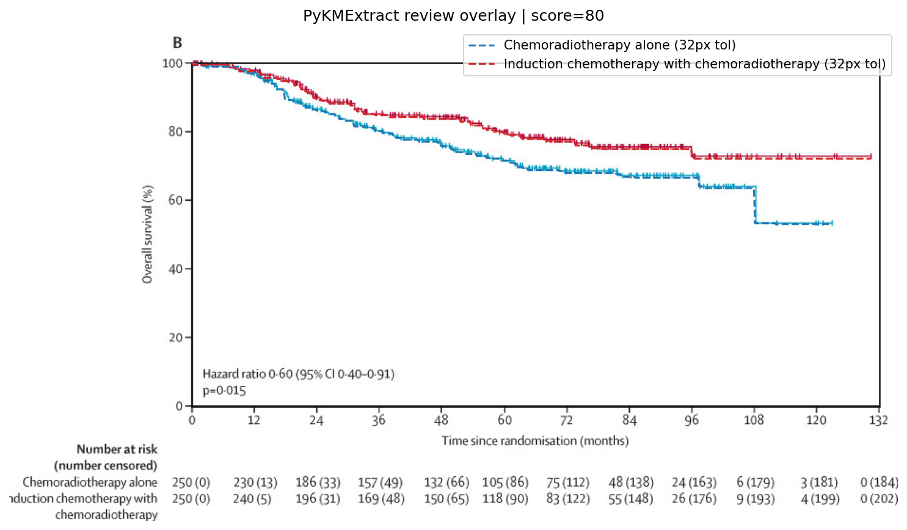
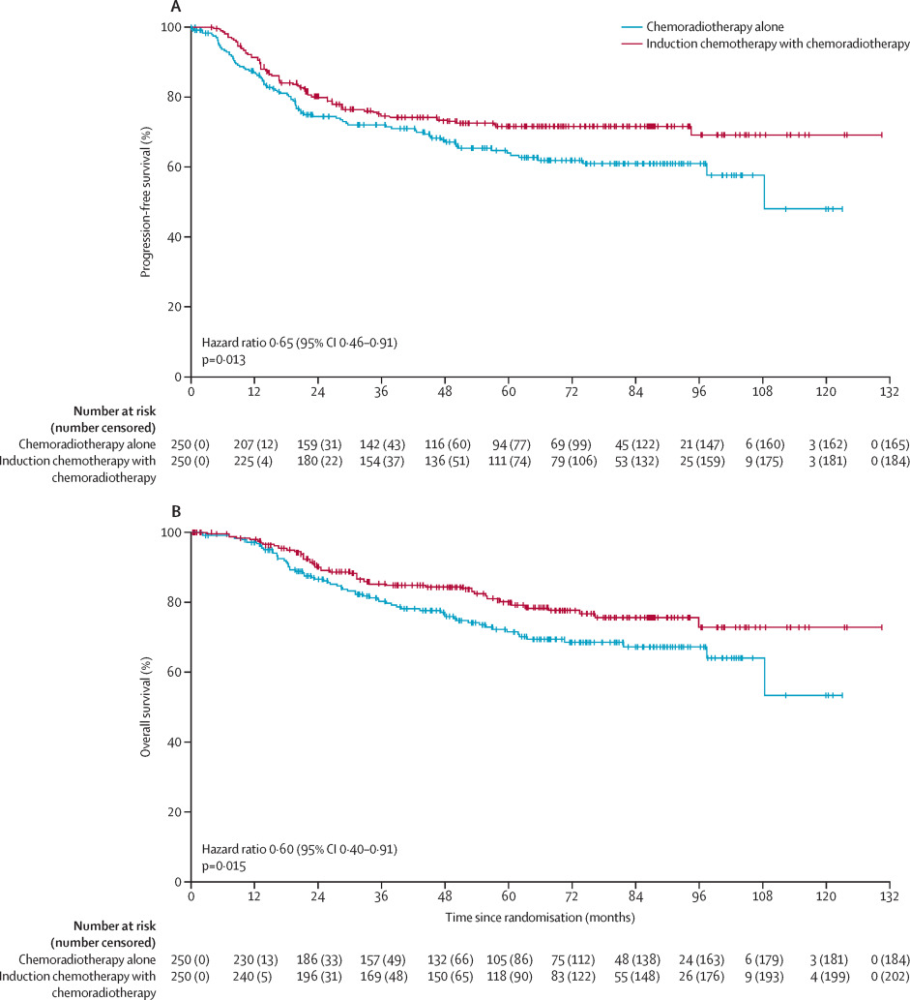

# Review Bundle: study05_os

## Summary

- Validation score: `80`
- Validation level: `high`
- Image: `study05_os.png`
- Notes: Focused on panel B (OS). Legend appears shared with panel A. At-risk table reports number at risk with cumulative number censored in parentheses; total_events_by_curve taken as final parenthetical values at 132 months.

## Citation

McCormack M, Eminowicz G, Gallardo D, Diez P, Farrelly L, Kent C, Hudson E, Panades M, Mathew T, Anand A, Persic M, Forrest J, Bhana R, Reed N, Drake A, Adusumalli M, Mukhopadhyay A, King M, Whitmarsh K, McGrane J, Colombo N, Mak C, Mandal R, Chowdhury RR, Alamilla-Garcia G, Chávez-Blanco A, Stobart H, Feeney A, Vaja S, Hacker AM, Hackshaw A, Ledermann JA; INTERLACE investigators. Induction chemotherapy followed by standard chemoradiotherapy versus standard chemoradiotherapy alone in patients with locally advanced cervical cancer (GCIG INTERLACE): an international, multicentre, randomised phase 3 trial. Lancet. 2024 Oct 19;404(10462):1525-1535.

## Side-by-Side Review

| Original panel | KM redrawn from reconstructed IPD |
| --- | --- |
|  |  |

## Overlay

## Semantic Context Figure

## Curves

- `Chemoradiotherapy alone`: 661 points, tolerance=32
- `Induction chemotherapy with chemoradiotherapy`: 716 points, tolerance=32

## Files

- [digitized_curves.csv](digitized_curves.csv)
- [ipd_chemoradiotherapy_alone.csv](ipd_chemoradiotherapy_alone.csv)
- [ipd_induction_chemotherapy_with_chemoradiotherapy.csv](ipd_induction_chemotherapy_with_chemoradiotherapy.csv)
