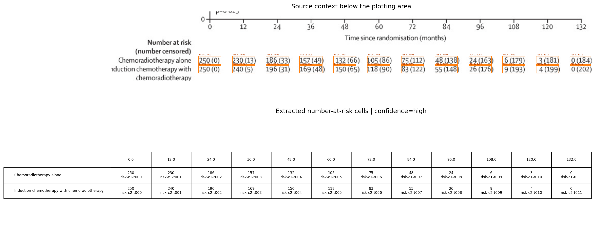

# Review Bundle: study05 OS

## Summary

- Visual acceptance: `pending model review`
- Diagnostic checks: `6/6 passed` (navigation only)
- Diagnostic issues: `0`
- Image: `study05_os.png`
- Notes: Focused on panel B (OS). Legend appears shared with panel A. At-risk table reports number at risk with cumulative number censored in parentheses; total_events_by_curve taken as final parenthetical values at 132 months.

## Citation

McCormack M, Eminowicz G, Gallardo D, Diez P, Farrelly L, Kent C, Hudson E, Panades M, Mathew T, Anand A, Persic M, Forrest J, Bhana R, Reed N, Drake A, Adusumalli M, Mukhopadhyay A, King M, Whitmarsh K, McGrane J, Colombo N, Mak C, Mandal R, Chowdhury RR, Alamilla-Garcia G, Chávez-Blanco A, Stobart H, Feeney A, Vaja S, Hacker AM, Hackshaw A, Ledermann JA; INTERLACE investigators. Induction chemotherapy followed by standard chemoradiotherapy versus standard chemoradiotherapy alone in patients with locally advanced cervical cancer (GCIG INTERLACE): an international, multicentre, randomised phase 3 trial. Lancet. 2024 Oct 19;404(10462):1525-1535.

## Side-by-Side Review

| Original panel | Digitization overlay |
| --- | --- |
|  |  |

## Number at Risk

## Curves

- `Chemoradiotherapy alone`: 664 points, tolerance=40
- `Induction chemotherapy with chemoradiotherapy`: 716 points, tolerance=40

## Validation Issues

- None

## Files

- [digitized_curves.csv](digitized_curves.csv)
- [validation_issues.csv](validation_issues.csv)
- [risk_table.csv](risk_table.csv)
- [risk_table.json](risk_table.json)
