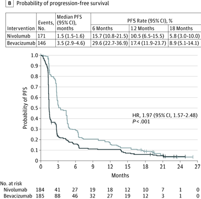
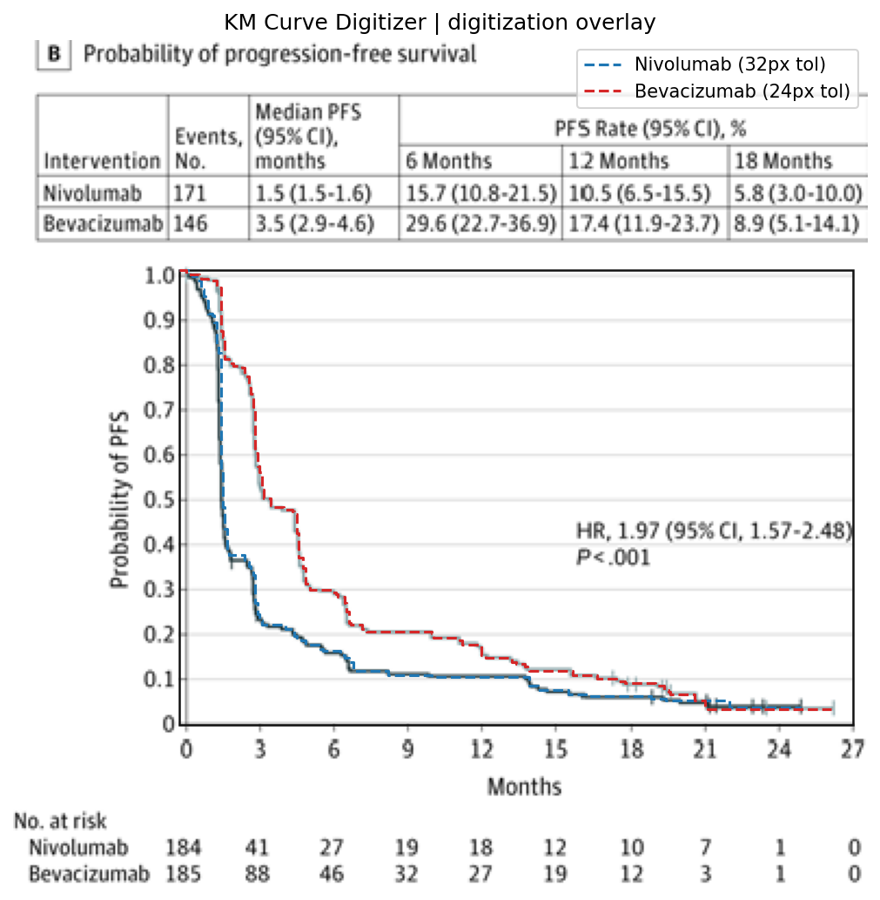
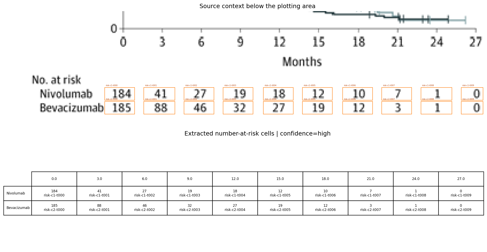

# Review Bundle: curve_edit_r0001

## Summary

- Visual acceptance: `pending model review`
- Diagnostic checks: `7/8 passed` (navigation only)
- Diagnostic issues: `4`
- Image: `study04_pfs.png`
- Notes: Extracted only from panel B (progression-free survival). Curve labels were inferred using the shared legend in panel A and intervention names shown in the panel B summary table. Median PFS table in panel B lists events as 171 for Nivolumab and 146 for Bevacizumab.

## Citation

Not provided

## Side-by-Side Review

| Original panel | Digitization overlay |
| --- | --- |
|  |  |

## Required Local Reviews

Acceptance requires comparing the source-only and overlay panes for every issue ID below.

- `q001-curve_identity_review`: [curve_identity_review](quality_hotspots/q001-curve_identity_review.png) — curves 'Nivolumab' and 'Bevacizumab' are within 4 pixels for 6 consecutive columns; inspect the source crop to confirm that neither trace changes identity
- `q002-curve_identity_review`: [curve_identity_review](quality_hotspots/q002-curve_identity_review.png) — curves 'Nivolumab' and 'Bevacizumab' are within 4 pixels for 7 consecutive columns; inspect the source crop to confirm that neither trace changes identity
- `q003-curve_identity_review`: [curve_identity_review](quality_hotspots/q003-curve_identity_review.png) — curves 'Nivolumab' and 'Bevacizumab' are within 4 pixels for 19 consecutive columns; inspect the source crop to confirm that neither trace changes identity
- `q004-curve_identity_review`: [curve_identity_review](quality_hotspots/q004-curve_identity_review.png) — curves 'Nivolumab' and 'Bevacizumab' are within 4 pixels for 6 consecutive columns; inspect the source crop to confirm that neither trace changes identity

## Required Left-to-Right Scan

Inspect every overlapping window, source first, then each curve-focused overlay. Complete `scan_review.json`; acceptance is blocked by unreviewed, defective, or ambiguous windows.

## Number at Risk

## Curves

- `Nivolumab`: 284 points, tolerance=32
- `Bevacizumab`: 299 points, tolerance=24

## Validation Issues

- `curve_identity_review`: curves 'Nivolumab' and 'Bevacizumab' are within 4 pixels for 6 consecutive columns; inspect the source crop to confirm that neither trace changes identity
- `curve_identity_review`: curves 'Nivolumab' and 'Bevacizumab' are within 4 pixels for 7 consecutive columns; inspect the source crop to confirm that neither trace changes identity
- `curve_identity_review`: curves 'Nivolumab' and 'Bevacizumab' are within 4 pixels for 19 consecutive columns; inspect the source crop to confirm that neither trace changes identity
- `curve_identity_review`: curves 'Nivolumab' and 'Bevacizumab' are within 4 pixels for 6 consecutive columns; inspect the source crop to confirm that neither trace changes identity

## Files

- [digitized_curves.csv](digitized_curves.csv)
- [validation_issues.csv](validation_issues.csv)
- [quality_hotspots.json](quality_hotspots.json)
- [scan_windows.json](scan_windows/scan_windows.json)
- [scan_review.json](scan_windows/scan_review.json)
- [risk_table.csv](risk_table.csv)
- [risk_table.json](risk_table.json)
