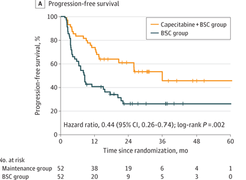
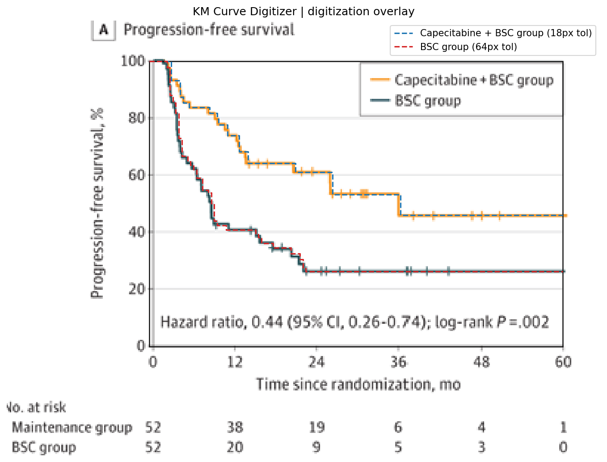

# Review Bundle: curve_edit_r0002

## Summary

- Visual acceptance: `pending model review`
- Diagnostic checks: `8/8 passed` (navigation only)
- Diagnostic issues: `0`
- Image: `study03_pfs.png`
- Notes: Focused on panel A (Progression-free survival). Legend labels taken from the PFS panel. Censoring marks are present on both curves. Hazard ratio text is visible but total events by curve are not reported.

## Citation

Not provided

## Side-by-Side Review

| Original panel | Digitization overlay |
| --- | --- |
|  |  |

## Required Local Reviews

No automatically localized high-risk regions.

## Required Left-to-Right Scan

Inspect every overlapping window, source first, then each curve-focused overlay. Complete `scan_review.json`; acceptance is blocked by unreviewed, defective, or ambiguous windows.

## Number at Risk

## Curves

- `Capecitabine + BSC group`: 25 points, tolerance=18
- `BSC group`: 30 points, tolerance=64

## Validation Issues

- None

## Files

- [digitized_curves.csv](digitized_curves.csv)
- [validation_issues.csv](validation_issues.csv)
- [quality_hotspots.json](quality_hotspots.json)
- [scan_windows.json](scan_windows/scan_windows.json)
- [scan_review.json](scan_windows/scan_review.json)
- [risk_table.csv](risk_table.csv)
- [risk_table.json](risk_table.json)
