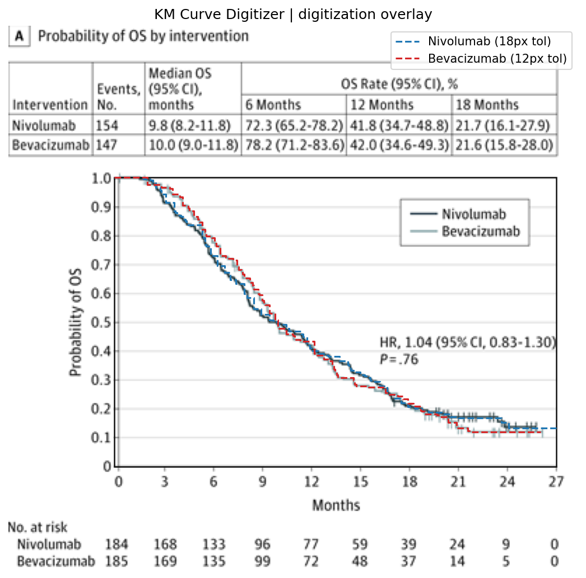
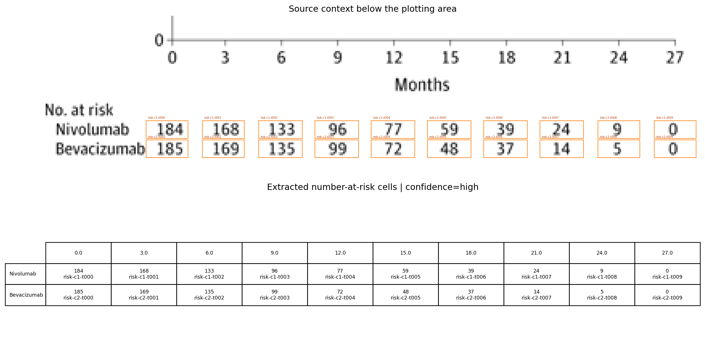

# Review Bundle: curve_edit_r0002

## Summary

- Visual acceptance: `pending model review`
- Diagnostic checks: `6/8 passed` (navigation only)
- Diagnostic issues: `9`
- Image: `study04_os.png`
- Notes: Focused on panel A (OS) only. Total events and median OS were taken from the OS summary table above the plot. Legend is inside the OS panel; curve-color mapping estimated visually.

## Citation

Not provided

## Side-by-Side Review

| Original panel | Digitization overlay |
| --- | --- |
|  |  |

## Required Local Reviews

Acceptance requires comparing the source-only and overlay panes for every issue ID below.

- `q001-source_gap_review`: [source_gap_review](quality_hotspots/q001-source_gap_review.png) — curve 'Nivolumab' is forward-filled across 10 columns without matching source-color pixels; inspect the source crop for a missed drop or trace switch
- `q002-source_gap_review`: [source_gap_review](quality_hotspots/q002-source_gap_review.png) — curve 'Nivolumab' is forward-filled across 14 columns without matching source-color pixels; inspect the source crop for a missed drop or trace switch
- `q003-source_gap_review`: [source_gap_review](quality_hotspots/q003-source_gap_review.png) — curve 'Bevacizumab' is forward-filled across 19 columns without matching source-color pixels; inspect the source crop for a missed drop or trace switch
- `q004-source_gap_review`: [source_gap_review](quality_hotspots/q004-source_gap_review.png) — curve 'Bevacizumab' is forward-filled across 10 columns without matching source-color pixels; inspect the source crop for a missed drop or trace switch
- `q005-source_gap_review`: [source_gap_review](quality_hotspots/q005-source_gap_review.png) — curve 'Bevacizumab' is forward-filled across 15 columns without matching source-color pixels; inspect the source crop for a missed drop or trace switch
- `q006-curve_identity_review`: [curve_identity_review](quality_hotspots/q006-curve_identity_review.png) — curves 'Nivolumab' and 'Bevacizumab' are within 4 pixels for 13 consecutive columns; inspect the source crop to confirm that neither trace changes identity
- `q007-curve_identity_review`: [curve_identity_review](quality_hotspots/q007-curve_identity_review.png) — curves 'Nivolumab' and 'Bevacizumab' are within 4 pixels for 14 consecutive columns; inspect the source crop to confirm that neither trace changes identity
- `q008-curve_identity_review`: [curve_identity_review](quality_hotspots/q008-curve_identity_review.png) — curves 'Nivolumab' and 'Bevacizumab' are within 4 pixels for 13 consecutive columns; inspect the source crop to confirm that neither trace changes identity
- `q009-curve_identity_review`: [curve_identity_review](quality_hotspots/q009-curve_identity_review.png) — curves 'Nivolumab' and 'Bevacizumab' are within 4 pixels for 7 consecutive columns; inspect the source crop to confirm that neither trace changes identity

## Required Left-to-Right Scan

Inspect every overlapping window, source first, then each curve-focused overlay. Complete `scan_review.json`; acceptance is blocked by unreviewed, defective, or ambiguous windows.

## Number at Risk

## Curves

- `Nivolumab`: 185 points, tolerance=18
- `Bevacizumab`: 291 points, tolerance=12

## Validation Issues

- `source_gap_review`: curve 'Nivolumab' is forward-filled across 10 columns without matching source-color pixels; inspect the source crop for a missed drop or trace switch
- `source_gap_review`: curve 'Nivolumab' is forward-filled across 14 columns without matching source-color pixels; inspect the source crop for a missed drop or trace switch
- `source_gap_review`: curve 'Bevacizumab' is forward-filled across 19 columns without matching source-color pixels; inspect the source crop for a missed drop or trace switch
- `source_gap_review`: curve 'Bevacizumab' is forward-filled across 10 columns without matching source-color pixels; inspect the source crop for a missed drop or trace switch
- `source_gap_review`: curve 'Bevacizumab' is forward-filled across 15 columns without matching source-color pixels; inspect the source crop for a missed drop or trace switch
- `curve_identity_review`: curves 'Nivolumab' and 'Bevacizumab' are within 4 pixels for 13 consecutive columns; inspect the source crop to confirm that neither trace changes identity
- `curve_identity_review`: curves 'Nivolumab' and 'Bevacizumab' are within 4 pixels for 14 consecutive columns; inspect the source crop to confirm that neither trace changes identity
- `curve_identity_review`: curves 'Nivolumab' and 'Bevacizumab' are within 4 pixels for 13 consecutive columns; inspect the source crop to confirm that neither trace changes identity
- `curve_identity_review`: curves 'Nivolumab' and 'Bevacizumab' are within 4 pixels for 7 consecutive columns; inspect the source crop to confirm that neither trace changes identity

## Files

- [digitized_curves.csv](digitized_curves.csv)
- [validation_issues.csv](validation_issues.csv)
- [quality_hotspots.json](quality_hotspots.json)
- [scan_windows.json](scan_windows/scan_windows.json)
- [scan_review.json](scan_windows/scan_review.json)
- [risk_table.csv](risk_table.csv)
- [risk_table.json](risk_table.json)
